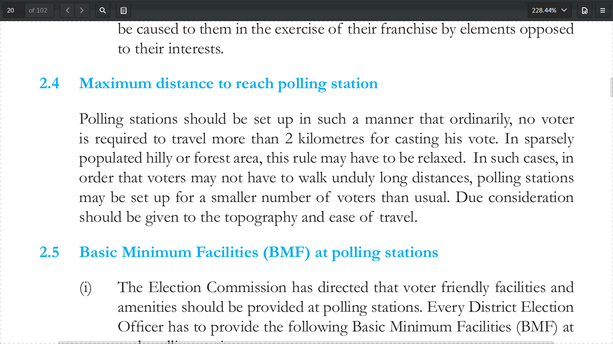

# TryingToKnowYouBetter

Now how could I meet people without meeting them in person (ofcourse I wouldn't meet them in person -_- )???

By Finding where they live!!

# Step 1:

Getting to know a whole bunch of people!

Hmm? Let's first try my home-town!

# Step 2:

Well...Now we need to find these EPIC numbers?????

At least they took the photos out now :)

A little pdf to txt and grep latter..TADA!

Now We have these EPIC people of Agra here in our list.

# Step 3:

With a little help of python let's automagically get this:

and finally this:

Alright people, calm down we just know a little bit about their age,sex,parent/spouse and yeah 
a little thing called their Polling Constituency and the Voting Poll Station.

# Step 4:

But where are these Constituencies??

Easy, just ask Google? No Let's ask the Election Commission itself!

Didn't like the Google Sattellite Map? They have the KML zips for you as well! :D

Open the zips and the kmls then in Google Earth and Voila! 

# Step 5:

Alright but what about individual polling stations? Well...

JSON gives up the coordinates as well...

# Step 6: 

Hmm...Now what did the Manual on Polling Station that I found on Google said:

Okay, So lets' see:

1. People go to the Polling stations (GPS's coordinates of which we have)
2. Polling Stations are set up to be in reach of People (No more than 2 Kms.)
3. People are lazy so they must be living in that 2 Kms. area (Plus they can only vote in their constituency)

# Which just leaves us with one thing. We can now add all these up and quite accurately predict who is living where in the city.

# Which is kinda terrifying and kinda Sad.

#  Code: Coming Soon...
 

